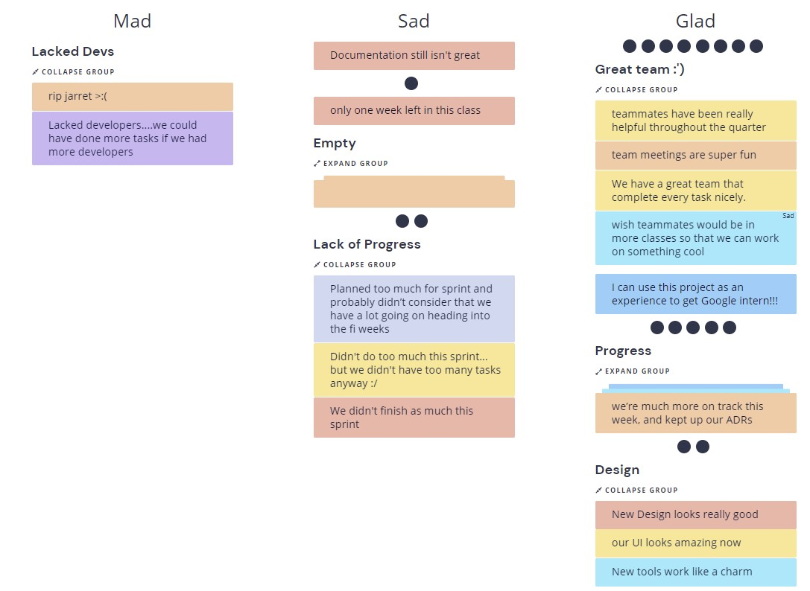

# Sprint 2 Retrospective

### Attendance
- Shwet
- Ethan
- Manav
- Stone
- Brian
- Jakob

### Discussion
- We thought that our team is really great
  - We're having a good time with our team members
  - We've all been very productive
  - We have not had too many communication errors
- Some felt that there was a lack of progress compared to the previous sprint
  - Some thought we didn't have too many tasks, others thought we had too much
- The majority felt we did make a lot of progress
  - We started this sprint early
  - We were much more on track, and were better about keeping ADRs this time around
  - We are almost done with the tasks we alotted to ourselves
- Our design looks really good
---
Picture of our retrospective:
